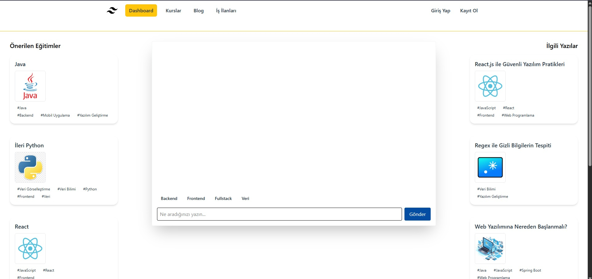
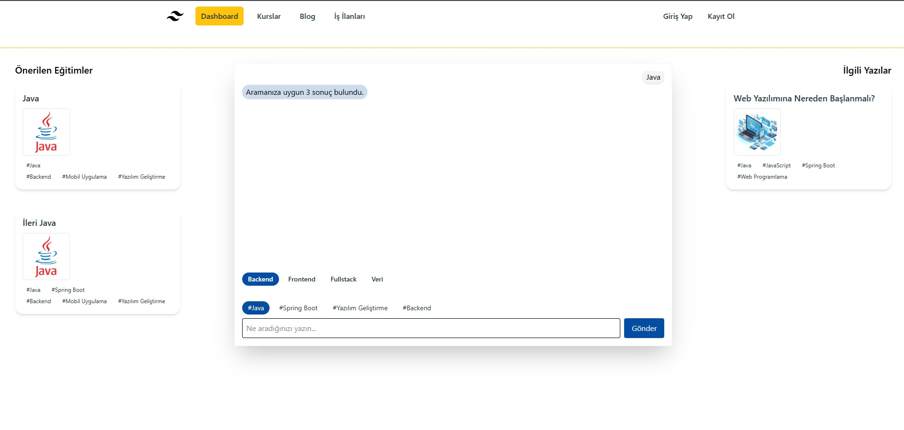
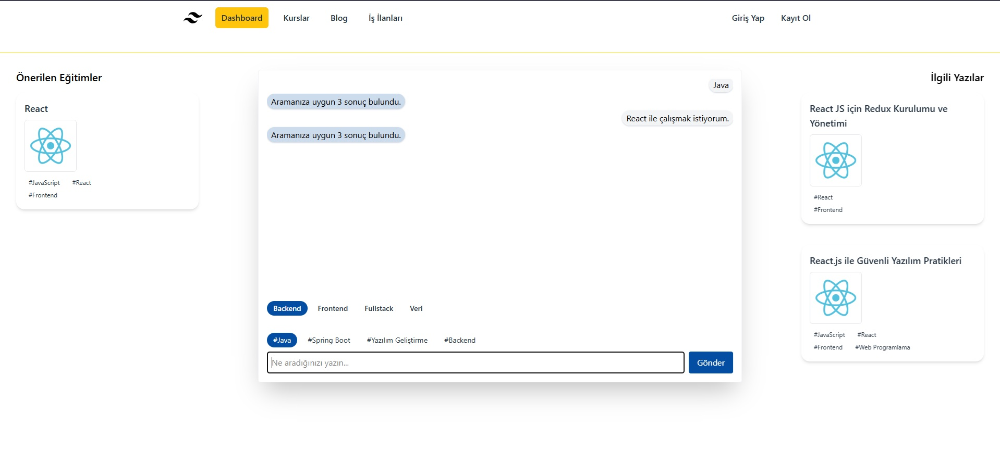
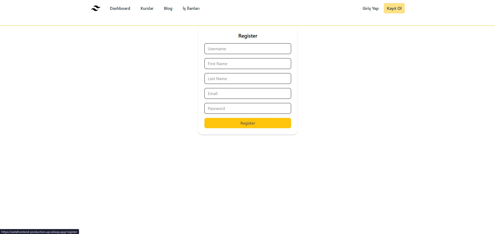
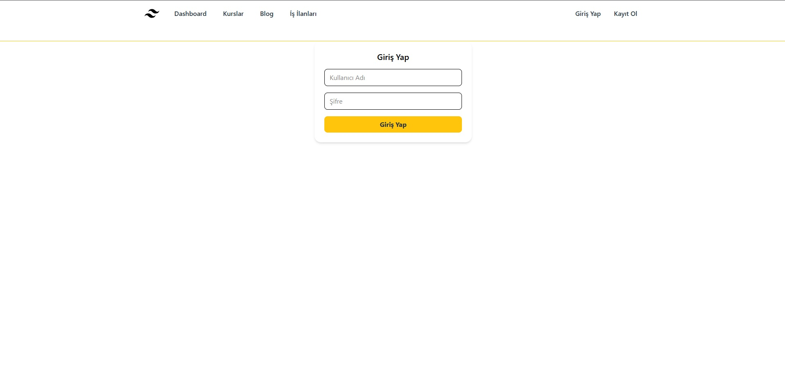

This project is a 	complementary project of  [AETA](https://github.com/BCemreD/AETA). React application that fetches and displays data from a backend API. It is styled with Tailwind CSS and uses a state management library to handle application data.

## Project Overview
This frontend serves as the user interface for an educational advisory platform. It's designed to simulate an experience similar to the "Geleceği Yazanlar" blog by pulling data from a separate backend API. The application allows users to view courses and blog posts, and to interact with them, such as marking them as favorites. Project can be checked with Railway: https://aetafrontend-production.up.railway.app/.

## Usage
- Teh dashboard shows default courses and blog with a chatbox.
- The chatbox includes predefined prompts to search for courses. The prompt bar allows custom queries to be sent to the backend..
- Registration and login features.
- Mock data from backend (PostgreSQL)
- Course and blog links redirect to external websites (to improve performance).

## 📸 Preview
### Dashboard:

### Prepared prompts

### Promptbar:

### Register:

### Login:


### In Progress
- Favorite button
- Dedicated favorites page
- Improved chatbot responses
- Career path recommendation module
- Job postings page
- Enhanced user features
- Multi-language support (English, German, …)

## Prerequisites
The following software must be installed on your system to run the project successfully:

- Node.js (LTS version): A JavaScript runtime environment.
- npm or yarn: A package manager for installing project dependencies.
- Git: A version control system to clone the project code.

## Technologies
- React
- TailwindCSS 
- Axios
- Zustand (state management with custom stores)
- Vite

### Setup and Running
#### 1. Install Dependencies
Open your terminal in the project's root directory and install the required packages:
```bash
npm install
```
or
```bash
yarn install
```
#### 2. Run the Backend Server
This frontend application is dependent on the backend API. By default, the backend is expected to run at http://localhost:8080. You can change this in the API client configuration (e.g., Axios base URL).

#### 3. Start the Application
Once the packages are installed and the backend is running, use the following command to start the application:

```bash
npm start
```
or
```bash
yarn start
```
The application will typically open automatically in your browser at http://localhost:3000.
 
# React + TypeScript + Vite

This template provides a minimal setup to get React working in Vite with HMR and some ESLint rules.

Currently, two official plugins are available:

- [@vitejs/plugin-react](https://github.com/vitejs/vite-plugin-react/blob/main/packages/plugin-react) uses [Babel](https://babeljs.io/) for Fast Refresh
- [@vitejs/plugin-react-swc](https://github.com/vitejs/vite-plugin-react/blob/main/packages/plugin-react-swc) uses [SWC](https://swc.rs/) for Fast Refresh


])
```
